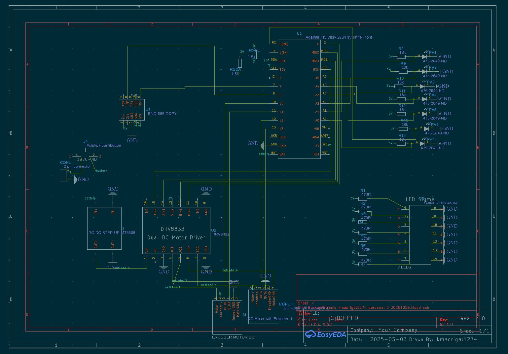
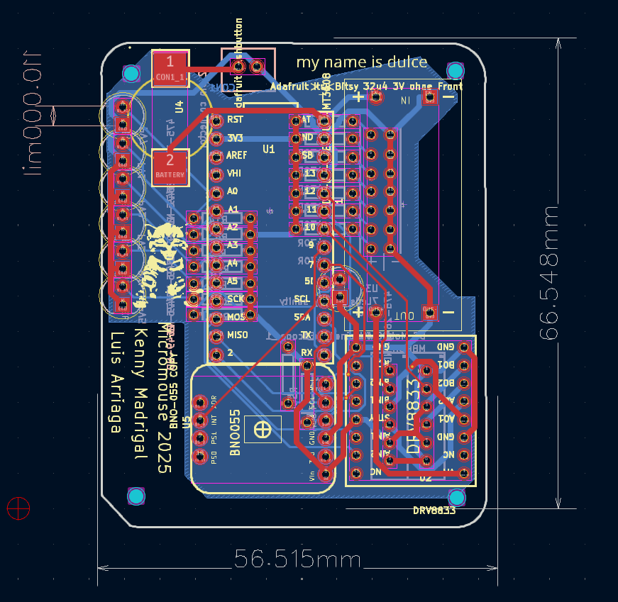

# Dulce - Micromouse Robot (Fall-Spring 2024-25; Backlog)

A micromouse robot project designed for autonomous maze navigation with comprehensive sensing and motor control capabilities. I would like to revisit this when I get the chance!

## Overview

Dulce is a micromouse robot built around the Adafruit Itsy Bitsy SAMD21 3.3V microcontroller. The design features multiple infrared sensors for wall detection, a 9-axis IMU for orientation tracking, and dual DC motors with encoders for precise movement control.

## Gallery

### PCB Design

*Circuit schematic*


*PCB board layout*

### Hardware Build (before PCB design)

*Perfboard prototype - top view*


*Perfboard prototype - side view*


*Perfboard prototype - detailed view*


*Wiring connections*


*Soldering setup at IEEE station*

## Bill of Materials

| Component | Part Number/Model | Quantity | Description |
|-----------|------------------|----------|-------------|
| Microcontroller | Adafruit Itsy Bitsy SAMD21 3.3V | 1 | Main controller (SAMD21 ARM Cortex-M0+) |
| IR Reflective Sensors | 475-2649-ND | 7 | Wall detection and positioning |
| IMU | BNO-055 | 1 | 9-axis absolute orientation sensor |
| DC Motors with Encoders | - | 2 | Differential drive system |
| Motor Driver | DRV8833 | 1 | Dual H-bridge motor controller |
| Battery Connector | 2-pin connector | 1 | Main power supply |
| Misc. Connectors | 2-pin connectors | Various | Modular connections |

## Project Status

### Current Implementation
- ✅ Hardware schematic design (imported from EasyEDA)
- ✅ Pin definitions configured in firmware
- ✅ Basic Arduino framework setup with PlatformIO

### Future Work

#### Documentation Improvements
- My schematic-drafting skills have improved since I last touched this project. I would like to clean up my schematic exports.

#### Hardware Improvements
- **Sensor Optimization**: Evaluate whether fewer IR sensors can be used while maintaining diagonal movement capability
- **Mode Selection**: Add toggle button to switch between different operating modes
- **Status Indicator**: Integrate RGB LED to display current operational mode

#### Mechanical Design
- Design and CAD a custom chassis optimized for the electronic components
- Ensure proper sensor placement for accurate wall detection
- Optimize weight distribution and center of gravity

#### Software Development
- Implement multiple operational modes:
  - Object-following
  - IMU + PID "Compass" - inspired by [Haridev](https://github.com/haribood)
  - Wall-following algorithm
  - Maze solving
- Develop sensor calibration routines
- Implement PID control for motor control
- Add mode-switching logic with visual feedback

## Development Setup

### Prerequisites
- PlatformIO installed (via VS Code extension or CLI)
- USB cable for programming the Itsy Bitsy

### Building the Firmware
```bash
cd firmware
pio run
```

### Uploading to Device
```bash
pio run --target upload
```

## Pin Configuration

### IR Sensors
| Sensor Position | Pin |
|----------------|-----|
| Front Left | A1 |
| Front Center | A0 |
| Front Right | A2 |
| Mid Left | A3 |
| Mid Right | A4 |
| Back Left | A5 |
| Back Right | 0 (RX) |

### IMU (BNO-055)
| Function | Pin |
|----------|-----|
| Reset | D7 |
| Interrupt | D9 |

### Motor Control
| Motor | Pin A | Pin B |
|-------|-------|-------|
| Left Motor | 30 (SCK) | 29 (MOSI) |
| Right Motor | 28 (MISO) | 2 |

### Encoders
| Encoder | Channel A | Channel B |
|---------|-----------|----------|
| Left | D10 | D11 |
| Right | D12 | D13 |

See [firmware/src/main.cpp](firmware/src/main.cpp) for complete pin definitions.

## Project Structure
```
dulce/
├── electrical/          # KiCad PCB design files
│   ├── dulce_easyeda.kicad_sch
│   └── dulce_easyeda.kicad_pcb
├── firmware/           # Arduino/PlatformIO firmware
│   ├── src/
│   │   └── main.cpp
│   └── platformio.ini
└── README.md
```

## License

See [LICENSE](LICENSE) file for details.

## Contributing

This is a personal project :P
